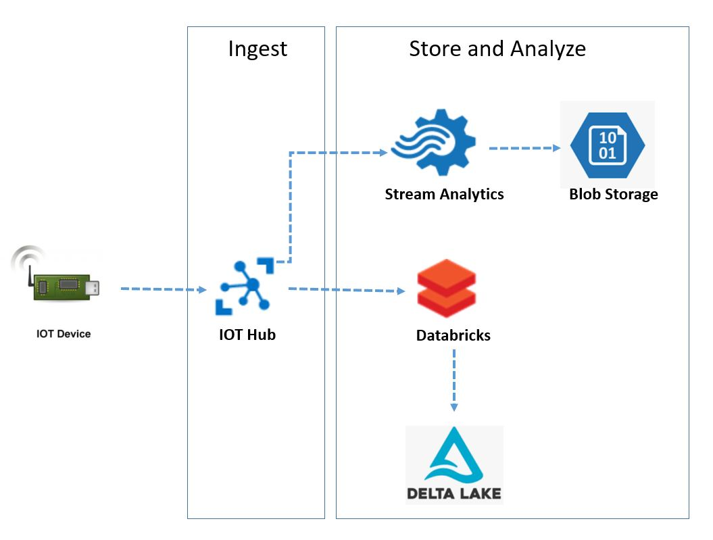

# datahub-iot
For IoT experimentation

 

<b>Solution Overview </b> 
- Simulated device running on the desktop sends streaming messages to IOT Hub
- The streaming data is consumed by a stream analytics job
- The stream analytics job outputs the data to two different containers
  -  Archive container - stores all the messages received from the input device and stores them as json files for long term storage and analysis 
  -  Alert container - stores data that meets specfic condition (eg: check for insances wehre the temperature reading was above 30 within a given window of time) 
- Databricks connects to the IOT Hub using the native connector  
- PySpark Structured Streaming API is used to read from an IoT Hub stream of data and write the data in it's raw format directly into Delta a table 

